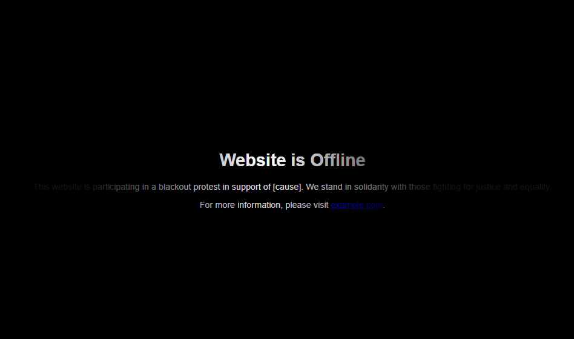
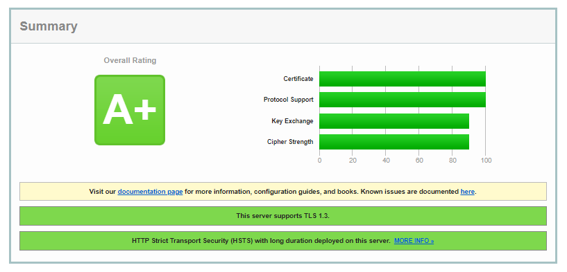

# Blackout Page
<h2>A simple HTML page with spotlight-like effect for participating in a blackout protest in support of any causes.</h2>

# Demo
https://everythingbagel.me/blackout-demo.html

## Prerequisites

- Nginx
- Your preference of SSL certificate

## Dependencies

This HTML page depends on the following:
- [NGINX](https://nginx.org/en/docs/) - A webserver
- [Certbot](https://certbot.eff.org/) - Open source software tool for automatically using Let’s Encrypt certificates
  
## Setup

1. Clone or fork the repository to your local machine or download the required files.
2. Navigate to the root directory of the repository.
3. Copy the HTML file to your project's root directory (e.g., `/var/www/html` or create a new one `/var/www/home` You can use your existing main project root.
4. If you already have SSL certificate for main domain, you can skip the Certbot installation step. and use existing certificate path.
5. Install the NGINX using the command `sudo apt install nginx`.
6. Install the Certbot using the command `sudo snap install --classic certbot`.
7. Obtain an SSL certificate from Let's Encrypt for your domain using the command `sudo certbot certonly --nginx -d example.com --rsa-key-size 4096`. (replace `example.com` with your domain). This step is optional if you already have a valid SSL certificate.
8. By default NGINX is usually located in `/etc/nginx` directory (Ubuntu). Edit the main `nginx.conf` file `sudo nano /etc/nginx/nginx.conf`.
9. Comment out the line `include /etc/nginx/sites-enabled/*;` in the "http" block and add the line `include /etc/nginx/sites-available/blackout.conf;`. (blackout.conf file inculded in repo)
10. Copy the `blackout.conf` from this repo to `/etc/nginx/sites-available/`
11. Create a symbolic link to enable the blackout configuration: `sudo ln -s /etc/nginx/sites-available/blackout.conf /etc/nginx/sites-enabled/blackout.conf`
12. Reload NGINX to apply the changes. `sudo systemctl reload nginx`.
13. Test the NGINX configuration for any errors: `sudo nginx -t`.
    
## Usage

- The blackout page is designed to minimize effort with only two file edits for flexibility.
- Place the `blackout.html` file in your project's root directory.
- Utilize the existing SSL certificate path from your non-main NGINX configuration project. (if available)
- Override and bypass other NGINX configurations that are in `/etc/nginx/sites-available/` with top-level `nginx.conf` as long as `include /etc/nginx/sites-enabled/*;` is commented out.
- The wildcard domain `*.example.com;` is used in `blackout.conf` to enable blackout on the domain and its subdomains.
- Easily reversible by uncomment `include /etc/nginx/sites-enabled/*;` and comment out `#include /etc/nginx/sites-available/blackout;` and reload NGINX.
- Can remove `/etc/nginx/sites-enabled/blackout.conf` symbolic link by running `sudo rm -r /etc/nginx/sites-enabled/blackout.conf`,although it's not necessary as `nginx.conf` handles it.

## What's inculded in the repo?
- A HTML file
- NGINX location block for CSS and images path. Open Graph support and A+ SSL ranking.

### I don't want the spotlight-like effect, how can I remove it?
Simply comment out or remove the relevant CSS code block responsible for the spotlight effect with `/* */`. Additionally, the div element with the `id="spotlight"`

### I want to use my own background image.
If there's no background-image specified, the background-color property will take precedence
`background-image: url('path_to_your_image.jpg');`

## Contributing

Pull requests are welcome to improve the blackout page (`blackout.html`) and the non-main NGINX configuration (`blackout.conf`).
If you have any suggestions for enhancing the blackout experience or optimizing the configuration, feel free to contribute to this repository.
Together, we can make the blackout protest more impactful and accessible to all.

## Troubleshooting

If you encounter any issues during setup or deployment, please refer to the NGINX and Certbot documentation for troubleshooting steps.

## License

This project is licensed under the MIT License - see the [LICENSE](LICENSE) file for details.
